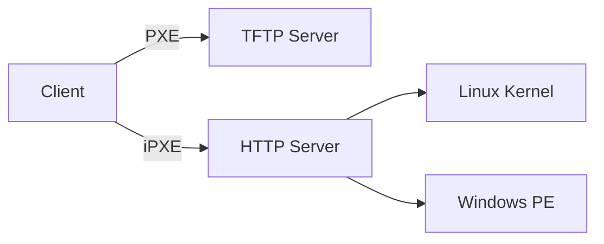

# 第一章：iPXE 基础原理

## 1.1 什么是无盘启动？

> 💡 **核心思想**：客户端不依赖本地硬盘，从网络加载操作系统。

### 1.1.1 传统 PXE vs iPXE

| 特性 | PXE | iPXE |
|------|-----|------|
| 协议支持 | 仅 TFTP | HTTP/HTTPS/FTP/iSCSI |
| 脚本能力 | 无 | 支持条件判断、循环 |
| 驱动 | 仅基础网卡 | 支持 WiFi/USB/VMware |



```bash
# 示例：iPXE 启动脚本
#!ipxe
dhcp
chain http://192.168.1.100/boot.ipxe
```

📌 **注意**：  
- Mermaid 代码块语言必须写 `mermaid`（不是 `graph`）  
- 代码块用 ```` ```bash ```` 明确标注语言（高亮更准）